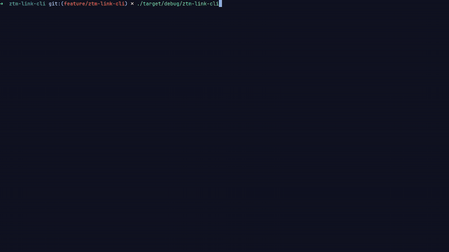

# ZTM Link CLI

A small terminal app for jumping straight to any [Zero To Mastery](https://zerotomastery.io) course or career path page. Pick one from a menu and it opens in your default browser.



## The problem

ZTM has well over a hundred courses and dozens of career paths. Finding one specific course page usually means opening a browser, going to the site, and searching or scrolling through the catalogue. This app makes it a few keystrokes from the terminal: choose Courses or Career Paths, type part of a name, and press Enter.

## Features

- **Always up to date:** the course and career-path lists are downloaded from [markodowd/zero-to-mastery-links](https://github.com/markodowd/zero-to-mastery-links) every time the app starts.
- **Type to filter:** the list shrinks as you type. Matching ignores case and looks for your text anywhere in the name.
- **Keyboard only:** arrow keys to move, Enter to choose, Esc to go back.
- **Opens your browser:** the selected page opens in your default browser on Linux, macOS and Windows.

## Install and run

### Requirements

- [Rust](https://www.rust-lang.org/tools/install) 1.85 or newer, because the project uses the 2024 edition
- An internet connection, to download the link lists

### Run

From this folder:

```bash
cargo run --release
```

To install it as a command you can run from anywhere:

```bash
cargo install --path .
ztm-link-cli
```

The app saves the downloaded lists to a `data/` folder inside the directory you run it from.

## Controls

| Key | Main menu | Course / career path list |
| --- | --- | --- |
| Type | — | Filter the list |
| Backspace | — | Delete the last filter character |
| ↑ / ↓ | Move | Move (scrolls when there are more than fit on screen) |
| Enter | Open the selected list | Open the selected page in your browser and exit |
| Esc | Quit | Back to the main menu |
| Ctrl+C | Quit | Quit |

## How it works

1. On start, the app downloads `course.csv` and `path.csv` from the links repo into `data/`. Each file has a header row and two columns: the name and the URL.
2. It reads both files with the [`csv`](https://crates.io/crates/csv) crate. Some course names contain commas, so splitting lines by hand isn't enough.
3. The menus are drawn with [`crossterm`](https://crates.io/crates/crossterm), which also handles colours and clearing the screen.
4. The chosen URL is opened with the [`open`](https://crates.io/crates/open) crate.

### Project layout

```
ztm-link-cli/
├── Cargo.toml
├── assets/
│   └── demo.gif    # README demo
├── src/
│   ├── main.rs     # download, CSV loading, main menu loop
│   └── picker.rs   # arrow-key picker with type-to-filter
└── data/           # created at runtime (git-ignored)
```

## How AI was used

This project was built with [Claude Code](https://claude.com/claude-code). I described each feature in plain English: downloading the data, the menu, filtering, colours and spacing. Claude Code wrote and tested the Rust code, and I reviewed each change and steered the design.

## License

[MIT](LICENSE)
